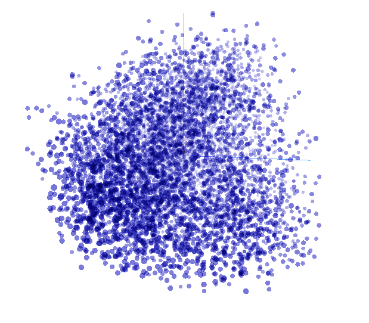
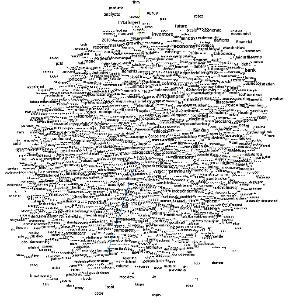
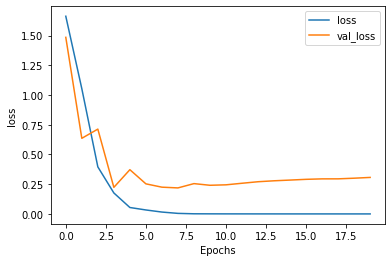
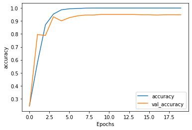

# Introducion
BBC News Content Classification is a multiclass classification problem. The dataset can be found at this source : http://mlg.ucd.ie/datasets/bbc.html

# Architecture
A simple Embedding from scratch and LSTM based Deep Neural Network is used to train and test the network. The model architecture is as follows:

|Layer(Type)|Output Shape|Parameters|
| --- | --- | --- |
|embedding (Embedding)|(None, 120, 64)|512000|
|lstm (LSTM)|(None, 64)|33024|
|dense (Dense)|(None, 256)|16640|
|dropout (Dropout)|(None, 256)|0|
|dense_1 (Dense)|(None, 6)|16640|
**Total params:** 563,206
**Trainable params:** 563,206

# Embedding
The embedding of 8000 different words, each embedded with a seperate vector having **64** dimensions. The embedding are initialized as random and are trained along with the training process. **The trained embedding can be interacted in depth in the following URL:** https://projector.tensorflow.org/?config=https://gist.githubusercontent.com/Arko98/b857c056350b0c38804de25b0e51ef03/raw/bcee757847d369accbfc0adc6bff7b1c603b2b76/projector_config.json

## A Snapshot of the trained Embedding Points:

## A Snapshot of the trained Embedding Words:

# Result
The Model obtained results as follows:
1) **Training Loss:** 8.6603e-05
2) **Training Accuracy:** **100%**
3) **Testing Loss:** 0.3070
4) **Testing Accuracy:** **94.83%**

## Loss Graph: 

## Accuracy Graph: 

